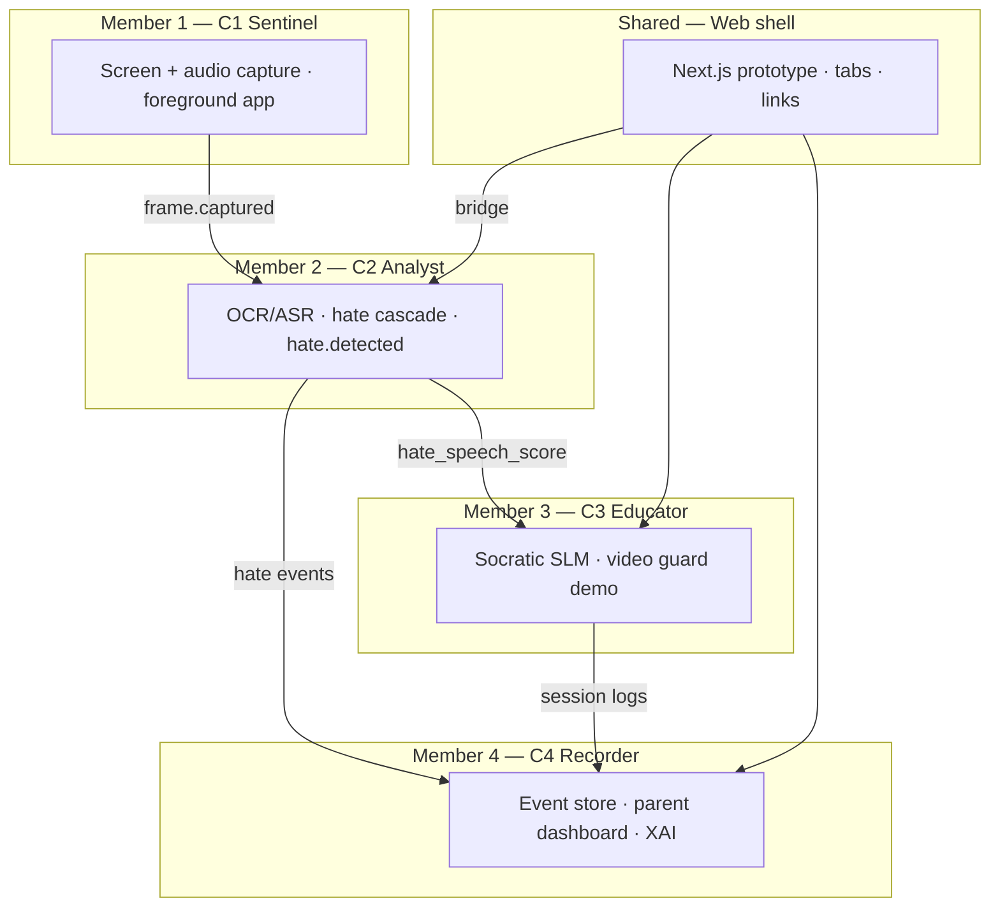

# J26-DS-316 — Guardian Digital Child Safety (MVP)

**Fully on-device AI for detecting harmful content and guiding children's digital safety**

| Field | Value |
|---|---|
| **Project** | J26-DS-316 · IT4010 · SLIIT CoEAI · Data Science |
| **Architecture** | Engineering Plan v0.1 (19 Aug 2026) |
| **Runtime** | Local processes only · **CPU-first** · **zero cloud at inference** |
| **Team model** | **4 components (C1–C4)** + shared web shell + integration bridge |

This repository is the **integrated Guardian MVP**. Each team member owns **one component**. Components talk through local HTTP APIs and (later) a ZeroMQ bus — not through the browser doing detection.

---

## How the four parts fit together



| Quick reference | C1 | C2 | C3 | C4 | Shared UI |
|---|---|---|---|---|---|
| **Port** | — (planned) | **8765** | **8000** | **8000** + **3000** | **3000** |
| **Primary folder** | *planned* | `analyst/` | `offline_backend/` | `app/parent/` + `dashboard_store.py` | `app/` |
| **Run command** | — | `py -3 -m analyst.serve` | `python main.py` | `npm run dev` → `/parent` | `npm run dev` |

**Hard rules (all members):** no cloud at inference · raw media RAM-only in C2 · detection stays in Python · parent sees redacted snippets only.

---

## Member 1 — Component 1: Sentinel (Capture Service)

| | |
|---|---|
| **Component ID** | C1 |
| **Role** | OS-level capture — owns screen frames, audio segments, foreground app identity |
| **Owner** | *Team member 1 — Capture / Sentinel* *(add name & student ID in team roster)* |
| **Status** | **Planned** — bus integration not in MVP yet |

### What C1 must deliver

- Subscribe/publish on local bus: `frame.captured`, activity events
- Provide `fg_exe`, window metadata, change scores — **no hate detection**
- Never persist raw child frames to disk

### In this repo today

| Item | Location | Notes |
|---|---|---|
| Temporary stand-in | `analyst/capture/` | `mss` screen + WASAPI loopback until C1 ships |
| Foreground app helper | `analyst/capture/process.py` | Windows foreground `exe` + title (used by C2 whitebox) |

### When C1 is ready

C2 will **stop** owning capture in `analyst/capture/` and only **consume** `frame.captured` messages from C1.

### Run (future)

```text
# Not shipped in this MVP — placeholder contract only
C1 process → publishes frame.captured → C2 analyst pipeline
```

---

## Member 2 — Component 2: Analyst (Hate-Speech Detection)

| | |
|---|---|
| **Component ID** | C2 |
| **Role** | Multimodal hate-speech cascade → `hate.detected` / `hate.cleared` |
| **Owner** | **Liyanage D. S.** · IT23209152 |
| **Status** | **Working** — CLI, live panel, whitebox, SQLite, evaluation harness |

### What C2 does

1. **Extract** — OCR + ASR (parallel), CLIP image embed  
2. **Stage 1** — lexicon + fast text + image probe (high recall)  
3. **Stage 2** — fusion + persona threshold by child age (precision)  
4. **Emit** — structured event with `child_safe_summary` (never echo raw hate to the child)

```
frame / audio / overlay text
        │
        ├─ OCR + ASR (parallel) + CLIP
        ▼
 Stage 1: lexicon ‖ text_fast ‖ image_fast
        │
   score < θ1 ──► clear (stopped_at_stage1)
        │
   score ≥ θ1
        ▼
 Stage 2: fusion(text, vision)
        │
   score ≥ θ2(age) ──► hate.detected → C3 + C4
        └── else ──► hate.cleared
```

Persona θ2: ages 8–10 → 0.55 · 11–13 → 0.65 · 14–15 → 0.75.

### Key folders & files

| Path | Purpose |
|---|---|
| `analyst/pipeline.py` | Core cascade |
| `analyst/decide.py` | `hate.detected` / `hate.cleared` contract |
| `analyst/extract/` | OCR, ASR, CLIP |
| `analyst/stage1/` · `analyst/stage2/` | Screen + fusion |
| `analyst/capture/` | Temporary capture (until C1) |
| `analyst/whitebox/` | Pipeline trace (blackbox → whitebox) |
| `analyst/store/` | SQLite + redacted persist |
| `analyst/panel/` | Localhost guard UI |
| `analyst/serve.py` | FastAPI panel server |
| `analyst/main.py` | CLI entry |
| `analyst/data/analyst.db` | Detection events (gitignored) |
| `analyst/evaluation/` | Benchmarks & corpora |
| `analyst/BUILD_STEPS.md` | Ordered build checklist |

### How to run (Member 2)

```powershell
cd <repo-root>
pip install -r analyst\requirements.txt
py -3 -m analyst.serve
```

| URL | Purpose |
|---|---|
| http://127.0.0.1:8765 | Live panel — Enable protection, Whitebox |
| http://127.0.0.1:8765/api/health | Health |
| http://127.0.0.1:8765/api/whitebox | Pipeline trace + foreground app |

**CLI (no panel):**

```powershell
python -m analyst --text "you should kys" --age 10
python -m analyst --replay analyst\demo_assets --age 10
python -m analyst.demo_e2e --age 10
```

**Tests:**

```powershell
python -m unittest discover -s analyst/tests -v
```

### What C2 publishes (team contract)

| Event / field | Consumers |
|---|---|
| `hate.detected` / `hate.cleared` | C3 (optional trigger), C4 (logging) |
| `child_safe_summary` | C3 Socratic context, C4 parent cards |
| `risk_score`, `category`, modalities | C4 dashboard, main app Hate Analyst tab |
| SQLite rows in `analyst.db` | C4 via `analyst_bridge.py` |

**Deep docs:** [`analyst/README.md`](analyst/README.md) · [`analyst/BUILD_STEPS.md`](analyst/BUILD_STEPS.md) · [`analyst/evaluation/README.md`](analyst/evaluation/README.md)

---

## Member 3 — Component 3: Educator (Socratic + Perception)

| | |
|---|---|
| **Component ID** | C3 |
| **Role** | Child-facing pedagogy when a threat is detected — Socratic dialogue + demo perception |
| **Owner** | *Team member 3 — Socratic Educator* *(add name & student ID in team roster)* |
| **Status** | **Working** — needs LM Studio for live SLM chat |

### What C3 does

- **Socratic state machine** — Acknowledge → Reason → Contract (deterministic phases)
- **Age routing** — protective prompts (≤10) vs autonomy prompts (≥11)
- **Perception trigger** — opens dialogue when scores breach thresholds (including **C2 hate score**)
- **Zero-Trust Video Guard** (demo) — ONNX models for NSFW / violence / weapons on uploaded or simulated frames

### Key folders & files

| Path | Purpose |
|---|---|
| `offline_backend/main.py` | FastAPI app on `:8000` |
| `offline_backend/socratic_agent.py` | Socratic agent + LM Studio client |
| `offline_backend/guard.py` | Video guard / perception demo |
| `offline_backend/tts_engine.py` | TTS helper (if enabled) |
| `offline_backend/model/` | ONNX weights (NudeNet, YOLO, MoViNet, etc.) |
| `app/page.tsx` | Sandbox + Video Guard UI (frontend for C3) |
| `app/components/SocraticInterceptorModal.tsx` | Intercept modal UI |
| `hooks/useSocraticVoice.ts` | Voice hook |

### How to run (Member 3)

```powershell
cd offline_backend
python -m venv venv
.\venv\Scripts\Activate.ps1
pip install -r requirements.txt
python main.py
```

**Also required for chat:** LM Studio on `http://localhost:1234` with a small model (e.g. `google/gemma-3-1b`).

| URL / endpoint | Purpose |
|---|---|
| http://127.0.0.1:8000 | API root |
| `POST /api/perception/trigger` | Start intercept (reads `hate_speech_score` from C2 if sent) |
| `POST /api/dialogue/turn` | Socratic chat turn |
| `GET /api/guard/state` | Video guard telemetry |
| `POST /api/guard/process-frame` | Analyse uploaded frame |

**Tests:**

```powershell
cd offline_backend
python -m unittest discover -s tests -v
```

### What C3 consumes / produces

| Input | From |
|---|---|
| `hate_speech_score`, other perception scores | C2 (via main app or auto-fill in trigger API) |
| `child_age`, `child_response` | Web UI |

| Output | To |
|---|---|
| Socratic session + turns | C4 `dashboard_store.py` |
| `threat_detected`, `session_id`, `initial_response` | Web UI Sandbox |

**Deep docs:** [`offline_backend/README.md`](offline_backend/README.md)

---

## Member 4 — Component 4: Recorder (Parent Dashboard & XAI)

| | |
|---|---|
| **Component ID** | C4 |
| **Role** | Parent-facing analytics — alerts, explainable AI, session history, metrics |
| **Owner** | *Team member 4 — Parent Recorder / Dashboard* *(add name & student ID in team roster)* |
| **Status** | **Working** — live C2 data via bridge |

### What C4 does

- Store and query **analyst runs** + **Socratic sessions**
- Parent dashboard: hate counts, recent alerts, threat breakdown, emotion trends
- Explainable AI cards — why content was flagged (redacted snippets)
- Poll backend every few seconds — **localhost only**

### Key folders & files

| Path | Purpose |
|---|---|
| `app/parent/page.tsx` | Parent dashboard UI |
| `offline_backend/dashboard_store.py` | JSON history (Socratic + legacy analyst runs) |
| `offline_backend/analyst_bridge.py` | **Read-only** merge from `analyst/data/analyst.db` |
| `offline_backend/main.py` | `GET /api/parent/dashboard-data` |

### How to run (Member 4)

C4 API runs with C3 backend (`python main.py` on `:8000`). UI needs Next.js:

```powershell
cd <repo-root>
npm install
npm run dev
```

| URL | Purpose |
|---|---|
| http://localhost:3000/parent | **Parent dashboard** |
| http://127.0.0.1:8000/api/parent/dashboard-data?child_age=10 | JSON API |
| http://127.0.0.1:8000/api/analyst/status | C2 bridge status |

### What C4 consumes

| Source | Data |
|---|---|
| C2 `analyst.db` | Hate runs, scores, snippets, app_exe (via bridge) |
| C3 `dashboard_store` | Socratic session starts + turns |
| C2 live panel | Online/capturing status |

### Bridge (integration — do not duplicate C2 logic)

`offline_backend/analyst_bridge.py` reads C2 SQLite **read-only**. C4 never runs detection models.

---

## Shared — Web prototype shell (`app/`)

| | |
|---|---|
| **Role** | Demo shell — navigation, Sandbox, links to all components |
| **Owner** | *Shared / integration* *(frontend + wiring)* |
| **Status** | **Working** |

### Pages & tabs

| UI | Connects to | Member |
|---|---|---|
| Prototype Sandbox | C3 perception + dialogue | M3 |
| Zero-Trust Video Guard | C3 `guard.py` | M3 |
| **Hate Analyst** tab | C2 `/api/analyst/status` + panel link | M2 |
| Parent Dashboard (`/parent`) | C4 API | M4 |
| Offline Python Hub | Source reference | M3 |

**Config:** `app/lib/backend.ts` — `BACKEND_URL` (`:8000`), `ANALYST_URL` (`:8765`)

---

## Run the whole application (all members)

Three terminals:

```powershell
# Terminal 1 — Member 2 (C2)
cd <repo-root>
pip install -r analyst\requirements.txt
py -3 -m analyst.serve

# Terminal 2 — Member 3 + 4 API (C3/C4)
cd offline_backend
.\venv\Scripts\Activate.ps1
python main.py

# Terminal 3 — Shared UI
cd <repo-root>
npm run dev
```

| Service | URL |
|---|---|
| Main app | http://localhost:3000 |
| Parent dashboard (M4) | http://localhost:3000/parent |
| Analyst panel (M2) | http://127.0.0.1:8765 |
| Backend API (M3/M4) | http://127.0.0.1:8000 |
| LM Studio (M3 chat) | http://localhost:1234 |

---

## Cross-component integration API

| Endpoint | Owner | Used by |
|---|---|---|
| `GET /api/health` · `/api/whitebox` | C2 `:8765` | Whitebox UI, debugging |
| `GET /api/analyst/status` | C4 bridge | Main app Hate Analyst tab |
| `GET /api/parent/dashboard-data` | C4 | Parent dashboard |
| `POST /api/perception/trigger` | C3 | Sandbox, C2 auto-intercept |
| `POST /api/dialogue/turn` | C3 | Socratic chat |
| `GET /api/guard/state` | C3 | Video Guard tab |

---

## Privacy & storage (all members)

| Data | Owner | Rule |
|---|---|---|
| Raw frames / audio | C2 | RAM only → wiped after tick |
| Detection events | C2 | `analyst.db` — scores + redacted snippets + blurred thumb |
| Socratic history | C4 | `dashboard_history.json` — local, capped |
| Parent UI | C4 | Polls localhost — no cloud |

---

## MVP status summary

| Member | Component | Status |
|---|---|---|
| M1 | C1 Sentinel | Planned — C2 `capture/` is temporary |
| M2 | C2 Analyst | **Working** — panel, whitebox, bridge, eval |
| M3 | C3 Educator | **Working** — Socratic + guard (LM Studio for chat) |
| M4 | C4 Recorder | **Working** — parent dashboard + live C2 alerts |
| Shared | Web shell | **Working** — tabs wired to C2/C3/C4 |

---

## Repository tree (by owner)

```
RP-J26-DS-316-MVP/
├── analyst/                 ← Member 2 (C2)
├── offline_backend/         ← Member 3 (C3) + Member 4 API (C4) + bridge
│   ├── socratic_agent.py    ← M3
│   ├── guard.py             ← M3
│   ├── dashboard_store.py   ← M4
│   └── analyst_bridge.py    ← C2→C4 integration
├── app/                     ← Shared UI
│   ├── page.tsx             ← M3 sandbox + M2 Hate Analyst tab
│   └── parent/page.tsx      ← M4 parent dashboard
└── README.md                ← This file — whole team overview
```

---

## References

- Engineering Plan v0.1 — J26-DS-316
- TAF V2.2 — Topic Assessment Form
- Member 2 detail: [`analyst/BUILD_STEPS.md`](analyst/BUILD_STEPS.md)
- Member 3 detail: [`offline_backend/README.md`](offline_backend/README.md)
- Evaluation (Member 2): [`analyst/evaluation/README.md`](analyst/evaluation/README.md)

---

*Update the **Owner** rows with each teammate's name and student ID when the team roster is final.*
